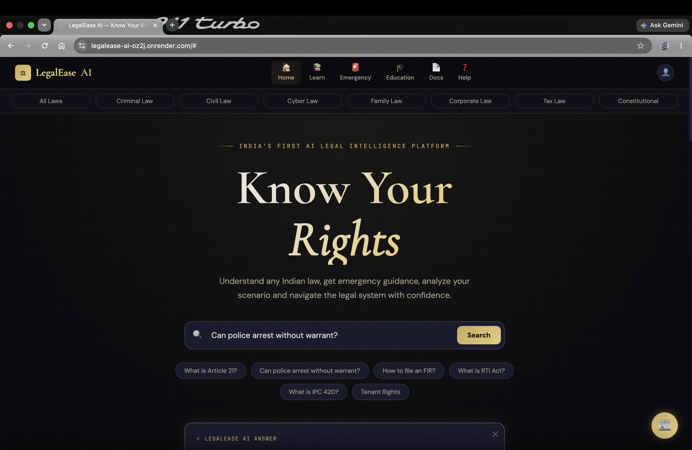
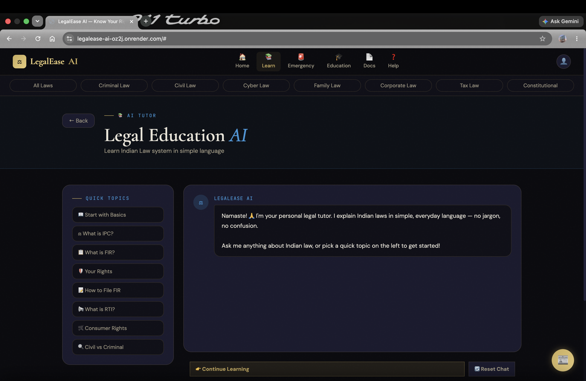
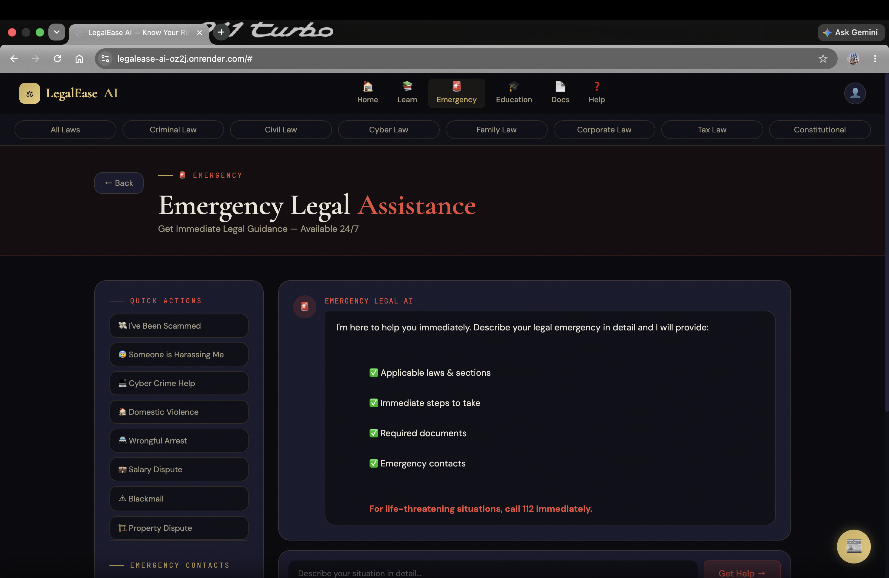
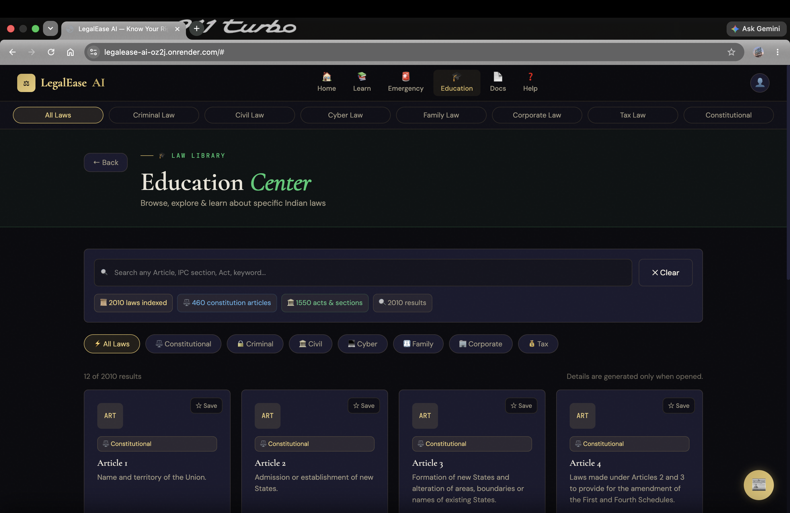
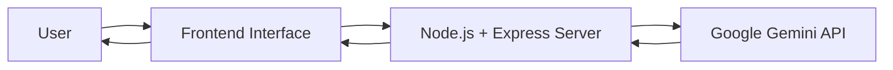

# ⚖️ LegalEase AI – AI-Powered Legal Intelligence Platform


LegalEase AI is an AI-driven legal assistance platform designed to simplify Indian laws and legal procedures for citizens. It empowers users with instant legal guidance, educational resources, emergency legal assistance, scenario analysis, and AI-powered document generation using Google's Gemini AI.

> **Disclaimer:** LegalEase AI is intended for educational and informational purposes only. It does not provide professional legal advice. Users should consult qualified legal professionals for legal matters requiring expert assistance.

---

## 🚀 Problem Statement

India faces a significant justice gap:

* **77%** of Indians lack access to formal legal advice or assistance.
* **70%+** of citizens are unaware of their legal rights.
* Legal consultations are often expensive and inaccessible.
* Emergency legal guidance is difficult to obtain quickly.
* Legal language is complex and difficult for common citizens to understand.

With over **500 million first-time internet users**, India needs a scalable, intelligent, and accessible legal assistance platform.

**LegalEase AI aims to democratize legal knowledge and empower every Indian citizen with accessible legal information.**

---

## 🌐 Live Demo

[🚀 Try LegalEase AI](https://legalease-ai-oz2j.onrender.com)

---

## ✨ Features

### 🤖 AI Legal Tutor

* Interactive legal Q&A powered by Google Gemini AI.
* Simplified explanations of Indian legal concepts.
* Step-by-step legal learning experience.

### 📚 Law Education Center

* Browse and explore Indian laws in simple language.
* Covers Constitutional Articles, IPC Sections, and legal concepts.
* Includes:

  * Official definitions
  * Simplified explanations
  * Real-world examples

### 🚨 Emergency Legal Assistance

Provides immediate legal guidance during urgent situations such as:

* Online scams and fraud
* Cybercrime incidents
* Harassment cases
* Wrongful arrests

Includes:

* Relevant laws and provisions
* Recommended next steps
* Required documentation guidance

### ⚖️ Scenario Analyzer

Describe a real-life legal situation and receive:

* Applicable Indian laws
* Risk assessment
* Recommended legal actions
* Practical next steps

### 📄 Legal Document Generator

Generate commonly used legal documents including:

* FIR Drafts
* RTI Applications
* Legal Notices
* Complaint Letters
* Affidavits

AI assists users in creating structured and ready-to-use legal documents.

### 📝 AI Quiz Generator

* Interactive quizzes on legal topics.
* Dynamic AI-generated questions.
* Progress tracking to encourage legal awareness.

### 📰 Legal News & Updates

Stay informed with:

* Latest legal news
* Judicial updates
* Important legal developments
* Daily legal tips

### ❓ Help & FAQ

* Quick answers to frequently asked legal questions.
* Accessible legal information without requiring a lawyer.

### 🌐 Multilingual Support

* English Support
* Hindi Support

### 🎨 Modern User Experience

* Responsive design for desktop and mobile devices.
* Light Mode and Dark Mode support.
* Clean and intuitive interface.

---

## 📸 Screenshots

### 🏠 Home Page


### 🤖 AI Tutor


### 🚨 Emergency Assistance


### 🎓 Education


---

## 🛠️ Technology Stack

### Frontend

* HTML5
* CSS3
* JavaScript

### Backend

* Node.js
* Express.js

### AI Integration

* Google Gemini API (Gemini 2.5 Flash)

### Deployment

* Render

### Version Control

* Git
* GitHub

---

## 📁 Project Structure

```text
LegalEase-AI/
├── index.html
├── styles.css
├── script.js
├── server.js
├── package.json
├── package-lock.json
├── .gitignore
├── .env.example
├── screenshots/
└── README.md
```

---

## ⚙️ Installation & Setup

### 1. Clone the Repository

```bash
git clone https://github.com/YashwantAnkatwar/legalEase-AI.git
cd legalEase-AI
```

### 2. Install Dependencies

```bash
npm install
```

### 3. Configure Environment Variables

Create a `.env` file in the root directory:

```env
GEMINI_API_KEY=your_gemini_api_key_here
```

### 4. Start the Application

```bash
node server.js
```

The application will run on:

```text
http://localhost:3000
```

---

## 🚀 Deployment

The project is deployed using **Render**.

### Required Environment Variables

| Variable         | Description           |
| ---------------- | --------------------- |
| `GEMINI_API_KEY` | Google Gemini API Key |

### Deploy on Render

1. Connect your GitHub repository to Render.
2. Create a new Web Service.
3. Set:

**Build Command**

```bash
npm install
```

**Start Command**

```bash
node server.js
```

4. Add the environment variable:

```text
GEMINI_API_KEY=your_actual_api_key
```

5. Deploy the service.

---

## 🔌 API Endpoints

| Method | Endpoint  | Description                                     |
| ------ | --------- | ----------------------------------------------- |
| `GET`  | `/health` | Check server status                             |
| `POST` | `/ai`     | Send prompts to Gemini AI and receive responses |

### Example Request

```json
{
  "prompt": "Explain Article 21 of the Indian Constitution",
  "mode": "legal-tutor"
}
```

---

## 🏗️ Architecture



---

## 🎯 Target Users

* General Citizens
* Students
* Rural Communities
* Activists
* Law Students

---

## 📈 Expected Impact

* Faster access to legal guidance.
* Improved legal literacy among citizens.
* Reduced confusion regarding legal rights and procedures.
* Increased accessibility to legal information across India.

---

## 🔮 Future Scope

* Support for additional Indian regional languages.
* Voice-enabled legal assistant.
* Verified lawyer consultation network.
* Court case tracking system.
* Mobile applications for Android and iOS.
* Secure cloud storage for legal documents.
* Legal awareness notifications and alerts.
* Government portal integration.

---

## 👨‍💻 Team

- Ashutosh Kumar
- Abhishek Kumar
- Nitish Verma
- Yashwant Ankatwar

GitHub: https://github.com/YashwantAnkatwar

---

## ⭐ Support

If you found this project useful, consider giving it a **star ⭐** on GitHub!

Together, let's make legal knowledge accessible to every Indian citizen.
